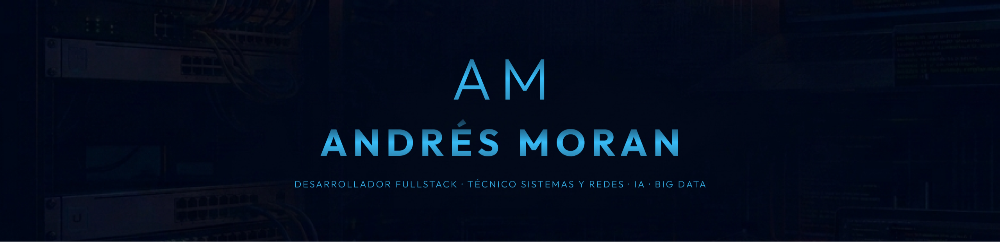

  

 

# ¡Hola! 👋 Soy Andrés Moran

Desarrollador con formación en Sistemas Microinformáticos y Redes y graduado en Desarrollo de Aplicaciones Multiplataforma en el IES La Mar (Xàbia), con especialización en Inteligencia Artificial y Big Data.

He trabajado en proyectos que abarcan aplicaciones Android, desarrollo web, herramientas con IA generativa, videojuegos y análisis de datos.

---

## 🚀 Proyectos Destacados

### 🕵️ Classified.ai
Juego de resolver un caso criminal generado e impulsado con Inteligencia Artificial.

[

---

### 🏡 ResiSuite
Aplicación móvil para la gestión de una residencia y aplicación de tablet con juegos para los residentes.

---

### 🕹️ Recreativa
Aplicación móvil con varios juegos offline desarrollados en Java.

---

### 🚢 BattleShip
Implementación del clásico juego Hundir la Flota.

---

### 📍 POI Manager
Gestor de puntos de interés.

---

### 🚗 Car Insurance Manager
Aplicación para la gestión de seguros de vehículos.

---

### ⚙️ MultiThreadApp
Proyecto para practicar programación multihilo en Python.

---

## 📫 Contacto

